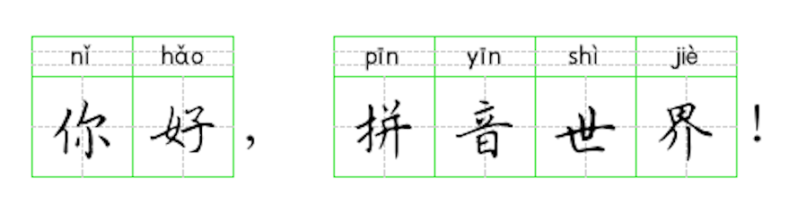
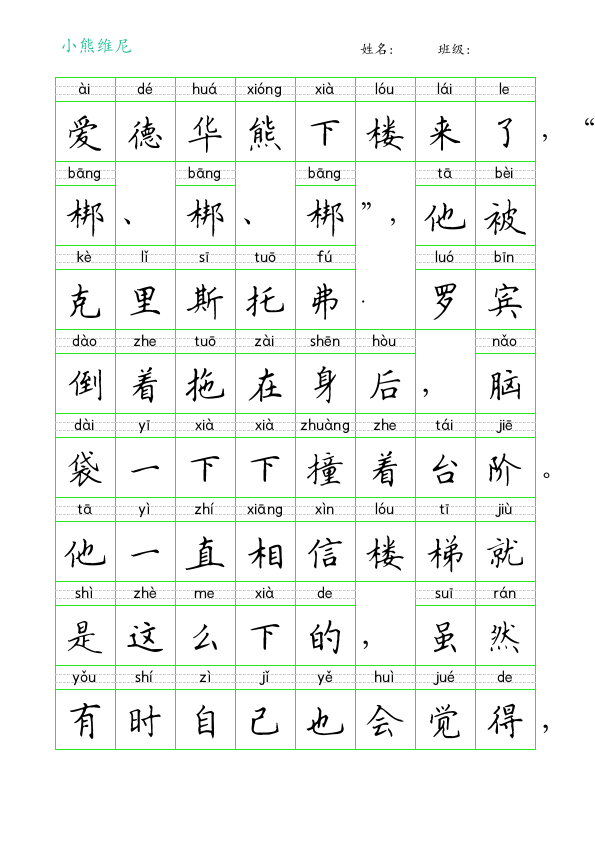
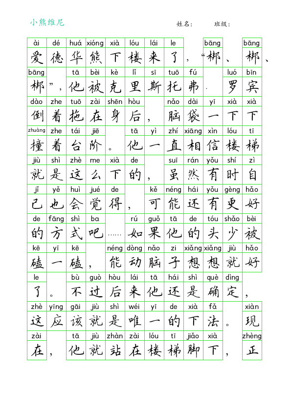

# pinyinCopybook

拼音汉字田字格A4模版, 排版后生成Pillow Image, python纯

==================================

## 使用说明

目前支持A4纸，每行8格和12格两种排版。如有其他格式需求，可以自行扩展。

* 每页8行，每行8格，使用:

``` python
from pinyinCopybook import Template

page = Template.generate_a4_grid_page(8)
```

* 每页11行，每行12格，使用:

``` python
page = Template.generate_a4_grid_page(12)
```

* 添加汉字和对应拼音

``` python
page.add_content('你', 'nǐ')
page.add_content('好', 'hǎo')
page.add_content('，', '，', 0, 1)
page.add_content('拼', 'pīn')
page.add_content('音', 'yīn')
page.add_content('世', 'shì')
page.add_content('界', 'jiè')
success = page.add_content('！', '！', 0, 1)
```



自动换行，当写满一页时返回 ```False```；更详细的用法请参考tests中的例子。

## 开源协议

本软件采用Apache 2.0协议，使用时请保留原始许可声明。

## 捐赠方式

如果您愿意给予我一点小小的支持，请扫码捐赠一杯咖啡吧，非常感谢！

| 支付宝 | 微信支付 |
| :------: | :------: |
|  |  |

## 页面效果




